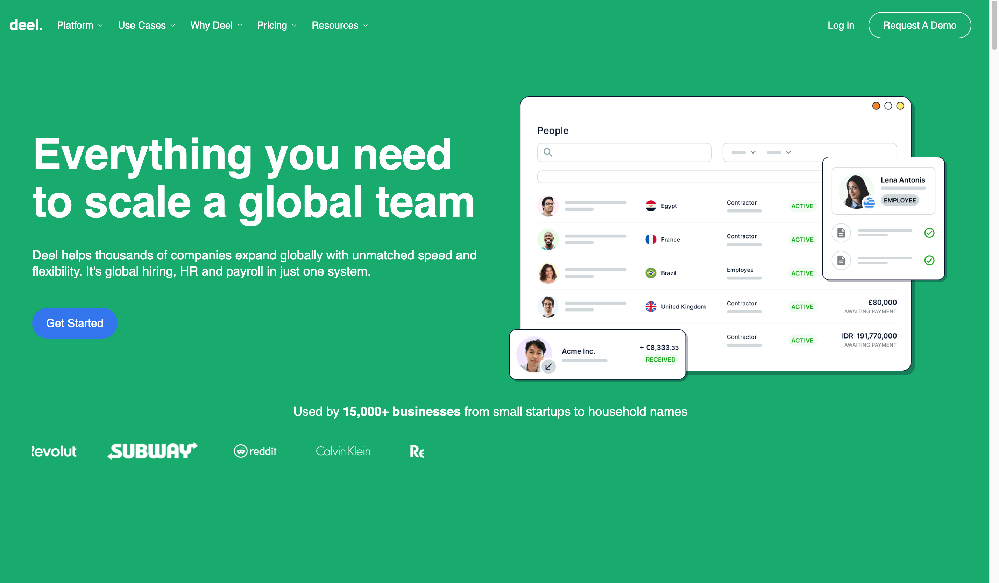
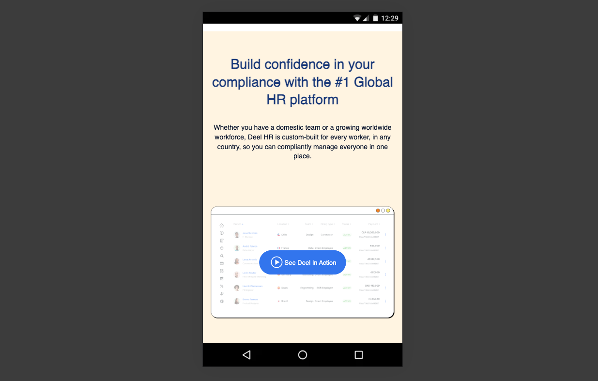

##DEEL WEBSITE

##F figma link
-figma url :[https://www.figma.com/design/NMJJ0G6IdiqQhYgLIK15H6/deel-HR-Company-Landing-page-(Community)?node-id=16-2&t=ugDxFdw7Ou6KQVFc-1]

## Table of contents

- [Overview](#overview)
  - [The challenge](#the-challenge)
  - [Screenshot](#screenshot)
  - [Links](#links)
- [My process](#my-process)
  - [Built with](#built-with)
  - [What I learned](#what-i-learned)
  - [Continued development](#continued-development)
  - [Useful resources](#useful-resources)
- [Author](#author)
- [Acknowledgments](#acknowledgments)


## Overview

This is a landing page that deals with employment and service satisfaction

### Screenshot





### Links

- Solution URL: [https://github.com/Prosper-Alex01010/deel]
- Live Site URL: [deel-phi.vercel.app]

## My process

### Built with

- Semantic HTML5 markup
- CSS custom properties
- Flexbox
- CSS Grid
- sass


### What I learned
Advanced grid and flex system

```html

          <marquee
            behavior="smooth"
            direction="seamless"
            class="featured-in-logos">
            
            
            
            
            
            
            
            
            
          </marquee>
```

